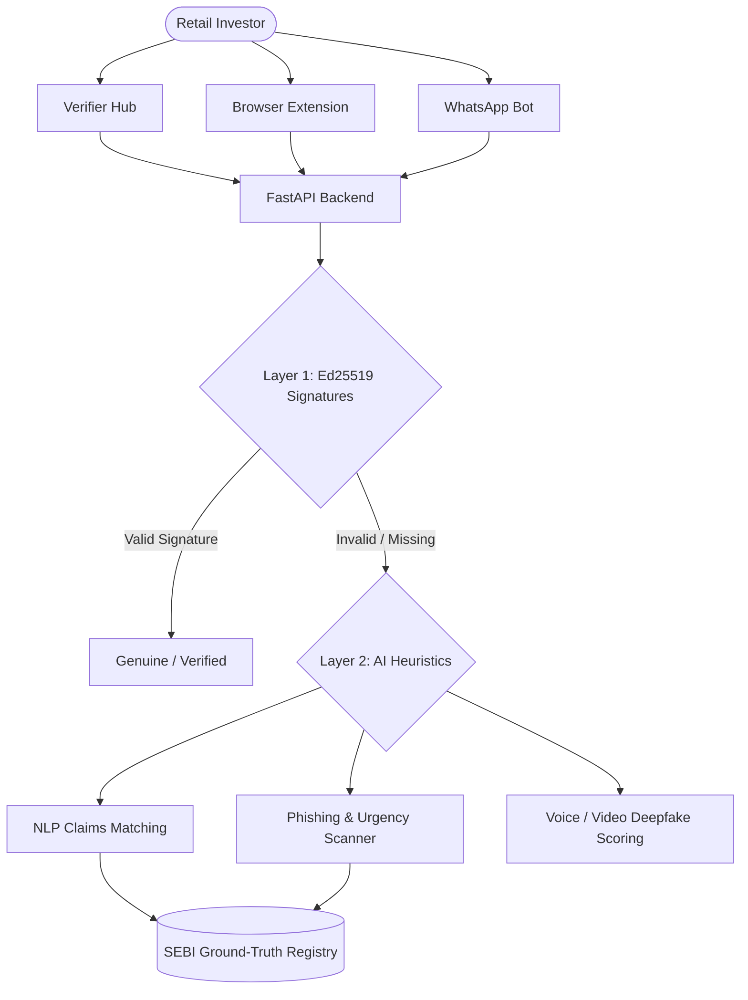

<div align="center">
  
  <br/>
  <h1>🛡️ SatyaCheck</h1>
  <p><strong>AI-Driven Detection & Authenticity Backbone for Securities Markets</strong></p>
  
  <p>
    
    
    
    
    
  </p>
</div>

---

## 📖 Overview

**SatyaCheck** is a next-generation security and verification ecosystem designed specifically to combat market manipulation, financial fraud, and deepfakes in the securities market. Built as a specification for the SEBI Hackathon, SatyaCheck acts as a zero-trust architecture verifying the provenance and authenticity of financial claims, circulars, and notices.

It employs a strict **Two-Layer Trust Architecture**:
1. **Layer 1 (Provenance):** Cryptographic Ed25519 signatures and C2PA manifests to guarantee 100% authenticity of official documents and media.
2. **Layer 2 (AI Heuristics):** Advanced NLP and media classifiers to catch unsigned anomalies, deepfakes, phishing attempts, and stock pumping claims against ground-truth registries.

---

## ✨ Core Modules

SatyaCheck isn't just a single app; it's an entire ecosystem:

*   **🛡️ Verifier Hub:** The central nervous system. Drag and drop PDFs, media files, or paste text to instantly scan for cryptographic signatures or AI-detected anomalies.
*   **🔑 Intermediary Portal:** A dedicated zone for registered brokers (e.g., Zerodha, Groww) to cryptographically sign and publish their communications, ensuring their brand isn't weaponized by scammers.
*   **📞 Call-Guardian (Voice API):** Real-time streaming voice analysis to detect AI-synthesized audio profiles (voice cloning) common in fraudulent "advisory" calls.
*   **💬 WhatsApp Bot Emulator:** Validates claims sent via chat messages against official SEBI registry data in real-time.
*   **🌐 Social Guard Feed:** Live monitoring of social media streams to flag pump-and-dump schemes or unregistered advisory handles.
*   **🧩 Browser Extension:** Real-time on-page verification of financial news, highlighting verified claims and blurring suspicious phishing links.

---

## 🏗️ Architecture



---

## 🚀 Quick Start (Local Development)

The repository is split into a monolithic structure containing both the React frontend and the Python backend.

### Prerequisites
*   Node.js (v18+)
*   Python (3.9+)

### 1️⃣ Start the Backend
The backend is powered by FastAPI and contains all the cryptographic logic and mock ML heuristic engines.

```bash
cd backend
python -m venv venv

# Windows
venv\Scripts\activate
# Mac/Linux
source venv/bin/activate

pip install -r requirements.txt
uvicorn main:app --reload --host 127.0.0.1 --port 8000
```
> *The backend will be live at `http://127.0.0.1:8000`*

### 2️⃣ Start the Frontend
The frontend is a gorgeous, responsive, and dynamic Vite + React application.

```bash
cd frontend
npm install
npm run dev
```
> *The frontend will be live at `http://localhost:5173`*

---

## 📡 API Endpoints

The FastAPI backend exposes several critical endpoints for ecosystem integration:

*   `GET /api/health` - Check backend health status.
*   `GET /api/registry` - Retrieve the mock SEBI intermediary and filings registry.
*   `POST /api/verify` - **Core Engine:** Accepts `text`, `envelope_json`, or `file`. Applies Layer 1 and Layer 2 checks and returns a comprehensive JSON verdict.
*   `POST /api/sign` - Utility endpoint to generate Ed25519 signed JSON envelopes or C2PA-injected files.
*   `POST /api/call-guardian` - Accepts sequential base64 audio chunks for real-time voice cloning detection.
*   `POST /api/translate` - Bhashini-mocked regional language translation for verification explanations.

---

## 🛡️ Security & Scalability Notes

*   **Robust Fetch Handling:** The frontend is strictly hardened with `AbortSignal` timeouts and HTTP 4xx/5xx interception to ensure no eternal buffering occurs if the network drops.
*   **Stateless Verification:** The backend verifies Ed25519 signatures completely statelessly using public keys, allowing infinite horizontal scaling for the `/api/verify` endpoint.
*   **Privacy-First:** Files uploaded for verification are analyzed in-memory and instantly discarded.

---
<div align="center">
  <i>Built with precision for the future of secure markets.</i>
</div>
